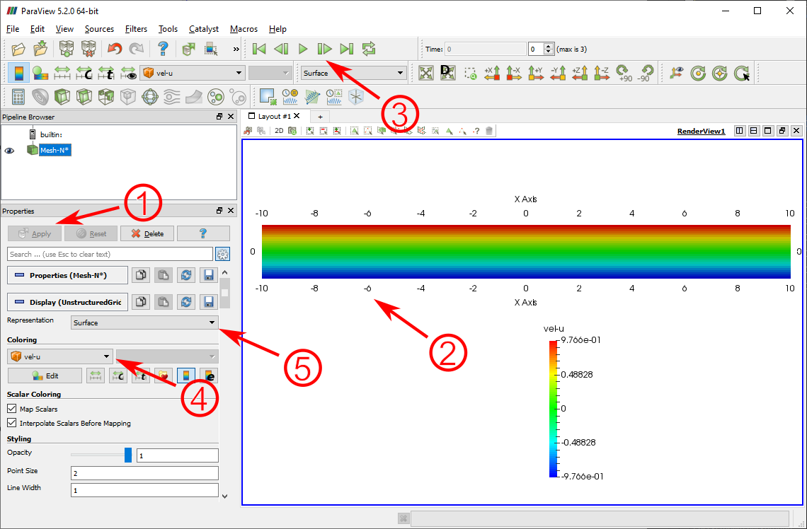
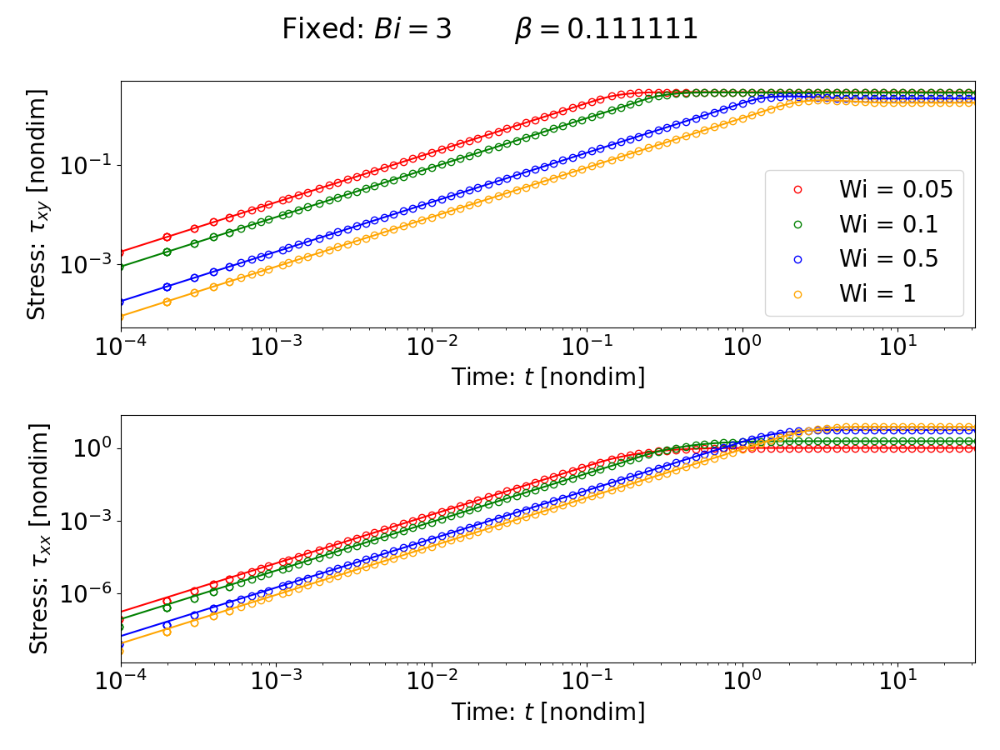
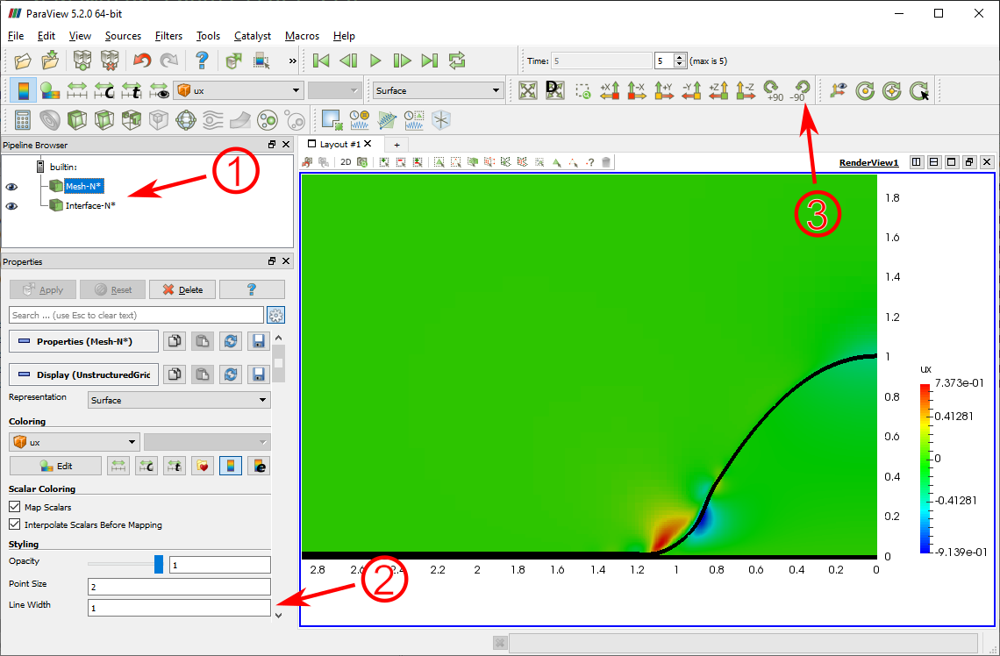

# Basilisk Starter Pack

This repository contains a set of examples to get you started with fluid simulations in Basilisk. These examples contain visualization and data output choices that we often use in the FluidLab, for example, outputting VTK files and visualizing in Paraview.

## Pre-requisites

You will need an installation of Basilisk in your machine. For the post-processing examples, you will also need an installation of Python. To visualize VTK files, we recommend using Paraview.

## Example 1: Shear flow of a Saramito fluid

This example simulates the flow of a Saramito fluid under simple shear. We output the polymeric stress over time and compare to a semi-analytical solution. VTK files are also created and these can be visualized in Paraview.

### Running a simulation
The first thing to do is compile your code. You can do this using the Basilisk compiler via the following command:  

<code> qcc shear_evp.c -lm -o shear_evp </code>

Now you can run the simulation through the command:

<code> ./shear_evp 0.05 1 0.111111  </code>

Note that we are passing 3 values as parameters to the simulation. Look into the code file and try to understand what each of these parameters represent.

While the simulation runs you will see a bunch of numbers being output to the screen. Once again, look into the code file and try to find out what they mean. Hint: look at the **logfile** event.

A subfolder for this simulation will also be automatically created inside the folder **outputs**. In this subfolder we are saving some log data and also the VTK files to be visualized.

Sometimes you don't want to run the simulation all the way till the end. You can manually cancel a linux process by using **Ctrl + C** in the terminal window.

### Visualizing VTK files

In the subfolder that was created by the simulation, you will find VTK files. Each file corresponds to an individual timestep in the simulation. Try to find in the code where we are generating these files and how often they are being printed. 

To visualize these files open Paraview and do:

<code> File -> Open -> [simulation_folder] -> Mesh-N..vtk </code>

You will see a window that should look something like this:

In the image above there are a few numbered points that you should notice. They are:

1. **Apply button**: after opening the file, make sure to click "Apply" so Paraview processes and renders the file data.

2. **Main view**: this is the main view window of your data. You can see the entire Basilisk domain and the colors representing the values of a scalar field.

3. **Timestepping bar**: you can cycle through timesteps using the buttons on this bar.

4. **Field selection**: the VTK contains the values of multiple scalar fields. You can change which field is being visualized by using this combo box.

5. **Representation type**: you can change how paraview displays the domain using this box. The "surface with edges" option is often very useful, as it shows you the Basilisk mesh as well.

One should note that there are many different ways of visualizing Basilisk data, for example, the built-in **bview** tool from Basilisk. In the FluidLab, so far, we are used to visualizing through VTK files and Paraview/Python, but feel free to explore other ways as well that might suit you best.

### Post-processing simulation data

You will notice that a log file was output in the simulation subfolders containing relevant data. We can use python scripts to process and plot this data as well.

An example script is also provided in this package. You can run it with the command:

<code> python startup_plots.py </code>

This script will look for data in the Basilisk simulation folders and will plot the results. Make sure you run the corresponding basilisk simulations before this script, otherwise it will not find the needed data.

You might need to install some python packages when you run this script for the first time. Also, make sure you adjust the first few lines of the script to match the parameters that you used in your simulations.
 
If you run the script, for example, for Bi = 3 and Wi = {0.05, 0.1, 0.5, 1}, you should get something like this:

To understand what is being plotted, you might want to read [Saramito's 2007 paper](https://www.sciencedirect.com/science/article/pii/S0377025707000869) (specifically the section on simple shear flow).

## Example 2: Droplet spreading (Saramito fluid)

This example simulates the spreading of an elastoviscoplastic droplet due to surface tension effects. 

### Running the simulation

To compile the example, run:

<code> qcc spreading.c -lm -o spreading </code>

Now you can run the simulation through the command:

<code> ./spreading 0 0.1 0 1 0.111111 100 1.00E-06 0.001 0.0005 0.0175 10  </code>

We are passing a lot of command line arguments. Try to see what they are by looking at the code. If you really want to understand the meaning of these parameters, you might want to read [Mazi's paper on EVP droplet spreading](https://arxiv.org/abs/2306.06640).

Note that this simulation takes a very long time to finish completely. Make sure you cancel the process after a while.

### Visualizing the VTK files

This example contains an interfacial boundary between two fluids (droplet and air). As such, two types of VTK files will be output in the folder:

1. Mesh files: containing all the scalar field data in the mesh (same as in example 1)
2. Interface files: contains an outline that indicates the location of the interface between the two fluids

Open these files in Paraview by doing:

1. File -> Open -> [simulation_folder] -> Mesh-N..vtk -> OK -> Click the "Apply" button

2. File -> Open -> [simulation_folder] -> Interface-N..vtk -> OK -> Click the "Apply" button

After tweaking some settings, you should see something looking like this:

In the image above there are a few numbered points that you should notice. They are:

1. **Pipeline browser**: this shows all the active files you have open. Before you change any settings, make sure you always select which file you actually want to change the settings of.

2. **Line width**: for the "Interface" files, you might want to use the "Surface" representation and increase the line width, so you can see the interface more clearly.

3. **Rotation**: for axisymetric simulations, it is often convenient to do a 90 degress rotation in the visualization. 

Make sure you also explore all the Paraview Mesh options mentioned in the first example. In particular: visualizing different scalar fields, visualizing the mesh cells and timestepping over the VTK files. Remember to select the "Mesh" in the Pipeline browser before changing these options!