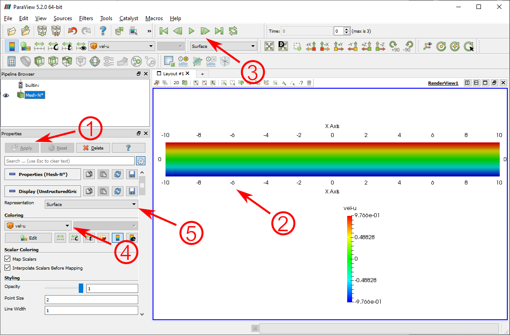
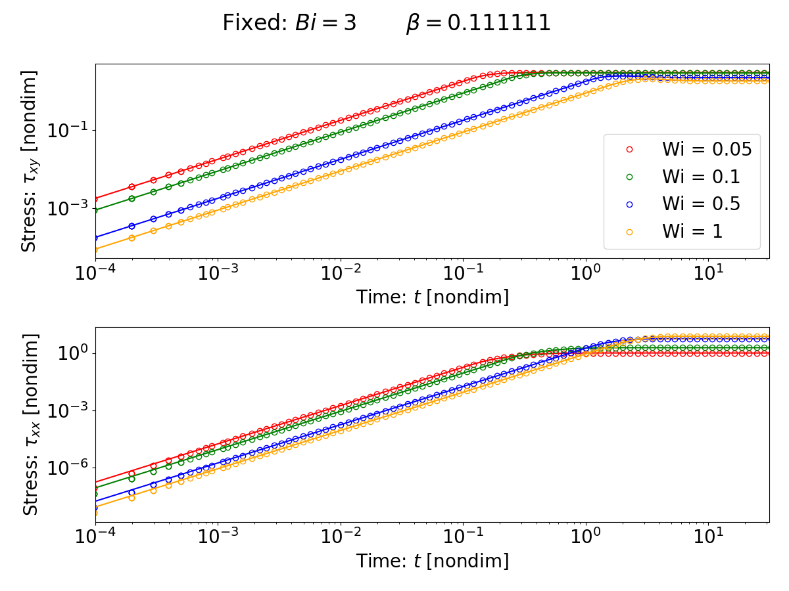
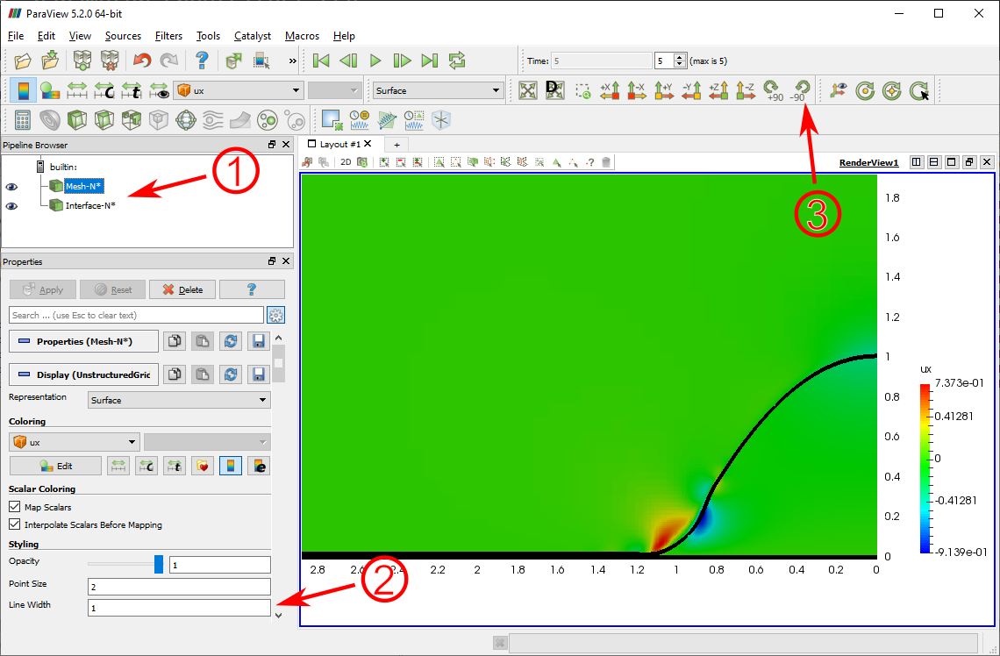
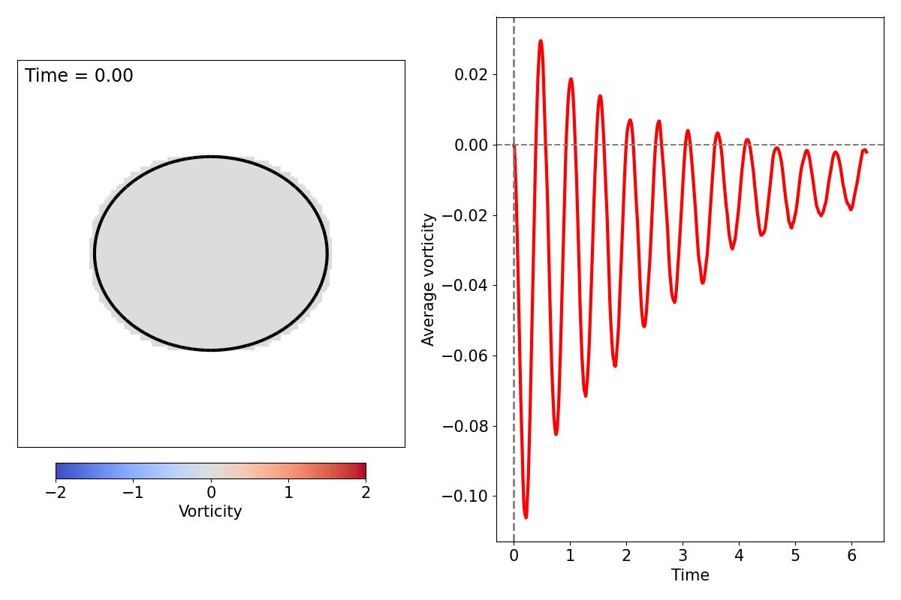
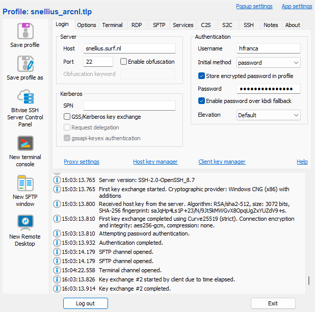
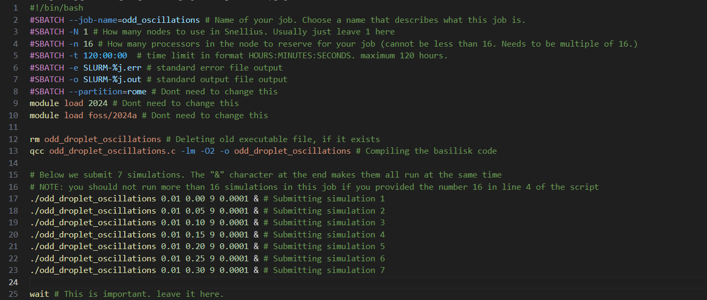
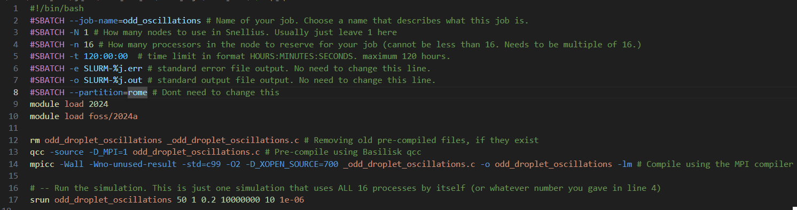

# Basilisk Starter Pack

This repository contains a set of examples to get you started with fluid simulations in Basilisk. These examples contain visualization and data output choices that we often use in the FluidLab, for example, outputting VTK files and visualizing in Paraview.

## Pre-requisites

You will need the following in order to go through this tutorial:
* A linux-based operational system. If you use Windows, you can install the [Windows Subsystem for Linux (WSL)](https://learn.microsoft.com/en-us/windows/wsl/install) through the steps below
    1. Type `Command Prompt` on the windows Start menu and choose the option `Run as administrator`.
    2. Run command: `wsl --install`.
    3. Restart your computer. Make sure you click "Restart" on the windows menu instead of "Shut down" (Yes, they do different things...).
    4. Open command prompt as administrator again.
    5. Type `wsl --install` again to finish installation. You will be asked to choose a username and password for your linux system. Note that, on linux terminals, when you type your password the characters do not appear on the screen at all (they are invisible).
    6. You should now be within your linux system. Check this by using the command "pwd" which should show you "/home/username" or something like that.
    7. Update your linux package manager with the command: `sudo apt-get update`  (you will be asked for your linux password).
    8. Install the code compiler with the command: `sudo apt install gcc`.
    9. Install the program "make" with the command: `sudo apt install make`.
    10. Tip: if you have never user linux before, read on some of the [important terminal commands](https://www.hostinger.com/tutorials/linux-commands), such as `cd`, `ls`, `pwd`.
* An [installation of Basilisk](http://basilisk.fr/src/INSTALL) in your linux system.
    1. Make sure you are on the terminal of your linux system in administrator mode.
    2. Download the Basilisk source code with the command: `wget http://basilisk.fr/basilisk/basilisk.tar.gz`
    3. Extract the source code with the command: `tar xzf basilisk.tar.gz`
    4. Enter the new extracted folder with the command: `cd basilisk/src`
    5. Prepare the configuration file with the command: `ln -s config.gcc config`
    6. Compile the code with the command: `make`
    7. Make sure you are still inside the src folder. Now add basilisk to your machine path with these two commands:
    `echo "export BASILISK=$PWD" >> ~/.bashrc` and  `echo 'export PATH=$PATH:$BASILISK' >> ~/.bashrc`
    8. Close the terminal window. Open a new one. Type `qcc`. If the command is found, then Basilisk is installed correctly*.
        
        *Note: if everything is fine, you will get a message similar to: `cc: fatal error: no input files`. This means the program `qcc` was found and everything is fine! If `qcc` is NOT found, you will get a message similar to `qcc: command not found`. Then something went wrong in the installation!
* Installation of [Python3](https://www.python.org/). 
    1. Check if it is already installed by typing `python` in the terminal of your linux system. Sometimes it is also called `python3`, try that one as well.
    2. If not, install it with: `sudo apt install python3`.
    3. Install the python module pip: `sudo apt install python3-pip`
    4. Install the python module numpy: `python3 -m pip install numpy`
    5. Install the python module matplotlib: `python3 -m pip install matplotlib`
    6. Install the python module scipy: `python3 -m pip install scipy`
* Installation of [Paraview](https://www.paraview.org/download/).
    1. If you're using Windows as your host machine, I would recommend installing this directly on Windows by downloading the installer from the website.
    2. If your machine is natively linux, you can install this with: `sudo apt install paraview`.
* Installation of [Ffmpeg](https://www.paraview.org/download/).
    1. Within your linux system, you can install this with: `sudo apt install ffmpeg`.

## Example 1: Shear flow of a Saramito fluid

This example simulates the flow of a Saramito fluid under simple shear. We output the polymeric stress over time and compare to a semi-analytical solution. VTK files are also created and these can be visualized in Paraview.

### Running a simulation
The first thing to do is compile your code. You can do this using the Basilisk compiler via the following command:  

<code> qcc shear_evp.c -O2 -lm -o shear_evp </code>

Now you can run the simulation through the command:

<code> ./shear_evp 0.05 3 0.111111  </code>

Note that we are passing 3 values as parameters to the simulation. Look into the code file and try to understand what each of these parameters represent.

While the simulation runs you will see a bunch of numbers being output to the screen. Once again, look into the code file and try to find out what they mean. Hint: look at the **logfile** event.

A subfolder for this simulation will also be automatically created inside the folder **outputs**. In this subfolder we are saving some log data and also the VTK files to be visualized.

Sometimes you don't want to run the simulation all the way till the end. You can manually cancel a linux process by using **Ctrl + C** in the terminal window.

### Visualizing VTK files

In the subfolder that was created by the simulation, you will find VTK files. Each file corresponds to an individual timestep in the simulation. Try to find in the code where we are generating these files and how often they are being printed. 

You can open these files in Paraview by doing:

1. File -> Open -> [simulation_folder] -> Mesh.vtk.series -> OK -> Click the "Apply" button

You will see a window that should look something like this:

In the image above there are a few numbered points that you should notice. They are:

1. **Apply button**: after opening the file, make sure to click "Apply" so Paraview processes and renders the file data.

2. **Main view**: this is the main view window of your data. You can see the entire Basilisk domain and the colors representing the values of a scalar field.

3. **Timestepping bar**: you can cycle through timesteps using the buttons on this bar.

4. **Field selection**: the VTK contains the values of multiple scalar fields. You can change which field is being visualized by using this combo box.

5. **Representation type**: you can change how paraview displays the domain using this box. The "surface with edges" option is often very useful, as it shows you the Basilisk mesh as well.

One should note that there are many different ways of visualizing Basilisk data, for example, the built-in **bview** tool from Basilisk. In the FluidLab, so far, we are used to visualizing through VTK files and Paraview/Python, but feel free to explore other ways as well that might suit you best.

### Post-processing simulation data

You will notice that a log file was output in the simulation subfolders containing relevant data. We can use python scripts to process and plot this data as well.

An example script is also provided in this package. You can run it with the command:

<code> python startup_plots.py </code>

This script will look for data in the Basilisk simulation folders and will plot the results. Make sure you run the corresponding basilisk simulations before this script, otherwise it will not find the needed data.

You might need to install some python packages when you run this script for the first time. Also, make sure you adjust the first few lines of the script to match the parameters that you used in your simulations.
 
If you run the script, for example, for Bi = 3 and Wi = {0.05, 0.1, 0.5, 1}, you should get something like this:

To understand what is being plotted, you might want to read [Saramito's 2007 paper](https://www.sciencedirect.com/science/article/pii/S0377025707000869) (specifically the section on simple shear flow).

## Example 2: Droplet spreading (Saramito fluid)

This example simulates the spreading of an elastoviscoplastic droplet due to surface tension effects. 

### Running the simulation

To compile the example, run:

<code> qcc spreading.c -O2 -lm -o spreading </code>

Now you can run the simulation through the command:

<code> ./spreading 0 0.1 0 1 0.111111 100 1.00E-06 0.001 0.0005 0.0175 10  </code>

We are passing a lot of command line arguments. Try to see what they are by looking at the code. If you really want to understand the meaning of these parameters, you might want to read [our paper on EVP droplet spreading](https://arxiv.org/abs/2306.06640).

Note that this simulation takes a very long time to finish completely. Make sure you cancel the process after a while.

### Visualizing the VTK files

This example contains an interfacial boundary between two fluids (droplet and ambient). As such, two types of VTK files will be created in the putputs folder:

1. Mesh files: containing all the scalar field data in the computational mesh.
   
2. Interface files: contains an outline that indicates the location of the interface between the droplet and the surrounding fluid (it is not a vacuum!)

Open these files in Paraview by doing:

1. File -> Open -> [simulation_folder] -> Mesh.vtk.series -> OK -> Click the "Apply" button

2. File -> Open -> [simulation_folder] -> Interface.vtk.series -> OK -> Click the "Apply" button

After tweaking some settings, you should see something looking like this:

In the image above there are a few numbered points that you should notice. They are:

1. **Pipeline browser**: this shows all the active files you have open. Before you change any settings, make sure you always select which file you actually want to change the settings of.

2. **Line width**: for the "Interface" files, you might want to use the "Surface" representation and increase the line width, so you can see the interface more clearly.

3. **Rotation**: for axisymetric simulations, it is often convenient to do a 90 degress rotation in the visualization. 

Make sure you also explore all the Paraview Mesh options mentioned in the first example. In particular: visualizing different scalar fields, visualizing the mesh cells and timestepping over the VTK files. Remember to select the "Mesh" in the Pipeline browser before changing these options!

## Example 3: Oscillation of a droplet with odd-viscosity

This example simulates the surface-tension driven oscillations of a droplet with odd viscosity.

### Running the simulation

To compile the example, run:

<code> qcc odd_droplet_oscillations.c -O2 -Wall -lm -o odd_droplet_oscillations </code>

Now you can run the simulation through the command:

<code> ./odd_droplet_oscillations 0.01 0.1 9 0.0001  </code>

Again, we are passing a lot of command line arguments. Try to see what they are by looking at the code. The variables "Oh" within the code refer to the Ohnesorge number of the system.

Note that this simulation takes a very long time to finish completely. Make sure you cancel the process after a while.

### Visualizing the output using python

We can also visualize interfacial an scalar field data using Python. An example script is also provided in this package within the "post_proc" folder. You can run it with the command:

<code> python make_video.py </code>

You might need to install some python packages when you run this script for the first time. Also, make sure you adjust the first few lines of the script to match the folder path where your simulation data is.
 
If you run the script, it will generate a video similar to the one below.

# Using the supercomputer Snellius

In this section, we explain how to obtain access and submit simulations to the supercomputer, Snellius.

## Obtaining access

1. Go to this link: [https://www.surf.nl/en/access-to-compute-services](https://www.surf.nl/en/access-to-compute-services)
2. Click on "Straight to the request portal"
3. Click on the "SURFconext" option and login with your UvA credentials. You can also use other university of research institute crediantials.
4. If you're an UvA student or worker click on the option "Apply for access: Direct institute contract". Note: you're NOT connected to the UvA, you will need to use the option "Apply for access: Small compute applications (NWO)", but this option is not available for bachelor/master students.
5. For the UvA access you will need to fill out a very short form with the following info
   1. Your organization (choose UvA)
   2. Is the request for GSI? (Choose No, unless it is...)
   3. Project title
   4. A short project description
   5. Type of request: usually you want just "Snellius CPU". Unless you're going to use a code that runs on GPU.
   6. SBU CPU Snellius: for the general student, requesting 150.000 SBUs is enough.  If you request significantly more than that, they might ask you later to give a short justification (which is also fine).
   7. Your first name, last name, and UvA email.
   8. Add another login? Choose No.
6. Wait for them to reply to you with a Snellius login and password. Will probably take one or two working days.

## Logging into Snellius

If you're using Windows, I highly reccomend accessing Snellius through a command called Bitvise. It can be downloaded here: [https://bitvise.com/](https://bitvise.com/)

1. Open Bitvise. Provide the Snellius server address and your login information. Fill out this information in the same way as in the image below, but with your own credentials
2. Click "Log in"
3. Optional: you can use the top-left button "Save profile" to save this setup into a file. This will automatically load this profile next time you open bitvise.
   

## Transferring files to and from Snellius

To transfer files between your computer and Snellius, do the following:

1. In the left part of the Bitvise window, click on "New SFTP window", which will open a new interface
2. This new interface has two panels: the left panel shows folders within your own computer, you can navigate through your local folders there. The right panel shows remote folder within your user area in Snellius.
3. To send files from your computer to Snellius:
   - On the left panel, select the local file(s) you want to transfer
   - On the right panel, navigate into the folder where you want to upload the file(s). You can also right-click in the right panel to create new folders.
   - Below the left panel, click "Upload"
4. To send files from Snellius to your computer
   1. Same as the item above, but from the right panel towards the left panel. And click "Download" after selecting the files.
   
## Using the command terminal within Snellius

To execute commands within the Snellius server, do the following:
1. In the main Bitvise window, click on "New terminal console" on the left panel.
2. The new console that is now open is a terminal window within snellius. So every command you run here will not run on your machine, it will run in the Snellius server.
3. This console is a usual linux command terminal, so all usual linux commands will work here, such as: cd, ls, cp, rm, pwd, mkdir, and others. If you never used linux command line before, this is a good time to spend a few minutes reading on some of these basic commands.
4. There are also some commands available that are specific to Snellius. See the section "Useful Snellius commands" later in this tutorial

IMPORTANT: in Snellius you should never run a simulation directly on the command terminal, like you would do in your computer. Snellius has a system called "SLURM", which manages submitted simulations into a queue, so that everyone gets to run their stuff if the system is crowded. You should only use the command terminal to run short scripts that take less than 5 minutes or so. If a command will take more than 5 minutes to run, then you should submit it as a job (see the section below).

## Installing Basilisk

If you're going to run Basilisk simulations, you need to install Basilisk within your Snellius area. Do the following:

1. Open a Snellius command terminal
2. Within this terminal, follow the Basilisk installation instructions that were given at the beginning of this tutorial. Note that this command terminal is already running linux, so you don't need to install the virtual subsystem. Just follow directly the linux instructions.

## Running simulations

To run a simulation on Snellius you need to "submit a job" to the server. I will teach here two ways of doing it: (1) for simulations that are usual single-process programs and (2) for simulations that are multi-process programs (MPI).

### Submitting one (or many) single-process simulations

If your Basilisk (or any other code) program runs as a single process, you will need to submit it with a batch script like the one in the image below. You can get the batch script file in this link: [[LINK]](readme_images/snellius_access/script_single.batch).

In this batch script, we submit multiple simulations that will run at the same time. Each simulation uses only one single process. Make sure to read all the comments in the batch script to understand what everything means.

### Submitting one multi-process simulations

Basilisk and some other codes allow you to parallelize your calculations using a library called MPI. This means a single simulation will use multiple processes at the same time to calculate things faster. To submit a simulation like this you need a batch script like the one in the image below. You can get the batch script file in this link: [[LINK]](readme_images/snellius_access/script_mpi.batch).

## Useful Snellius commands

In the Snellius command terminal, there are some useful commands you can use to check your simulations and other things.

### <ins>Submitting a job (simulation): sbatch</ins>
To submit a job (one, or many simulations) you will first needs a batch script. See the previous section to learn how to create a batch script and see examples.

After you have your batch script you can submit the job using the command `sbatch my_script.batch`

### <ins>Checking simulations currently running: squeue</ins>

To see which jobs you currently have running you can use the command: `squeue`

Sometimes your jobs have names that are really long and don't appear fully in the command above. In that case you can use this slightly more elaborate command: `squeue --format="%i %.10M %.30j %.10T"`

### <ins>Cancelling a job that is running: scancel</ins>

To cancel a job that is running, do the following:
1. Run the `squeue` command and find the number (JOBID) identifying this job.
2. Cancel the job with the command: `scancel XXXXXXXX`

You can check that it was succesfully cancelled by running `squeue` again.

### <ins>Checking how much disk space you still have available: myquota</ins>

Use the following command: `myquota`

The first line of the "home" output will show you the percentage of the total 200GB that you have already used.

The second line (Inodes) will show you how many individual files you have saved (in percentage). There is also a maximum value for this, but it's usually not an issue. 

### <ins>Checking how many SBUs you still have available: accinfo</ins>

Remember that you have a limit in how many hours you can run, this is given by the amount of SBUs you requested when you created your account. 

To check how many SBUs you already used up, use the command: `accinfo`